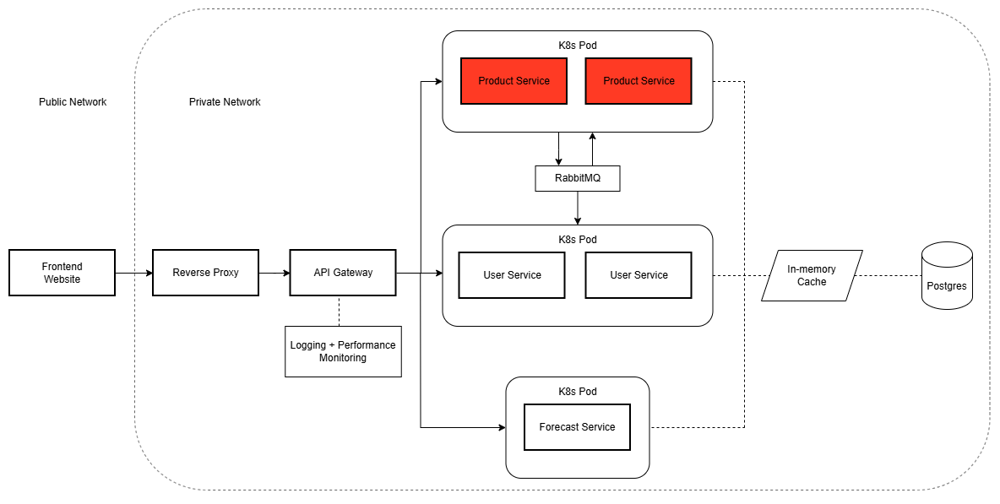

# Product Service

This service handles:
- Products
- Bundles
- Allergens
- Reservations

This service handles the relationship between products, bundles, allergens and reservations, allowing users and vendors to access the endpoints. 
This service pushes messages to RabbitMQ when a vendor verifies a claim code, so the streak on the User Service can be updated.
The Image below highlights where in the architecture this service operates.

  

## Documentation

## Tech Stack

### Core & Build

### Database

### Deployment

### Messaging

### Testing

## How to Run Tests

## Contribution

**Author: Robert Rainer**

 

**Author: Daniel Jackson**
- Led code structure discussions with Robert Rainer about using the MVC model
- Setup Bundle Components:
    - Created Bundle Endpoints and specified the data required in the request
    - Created endpoints that support pagination for SQL queries
    - Validated incoming requests data at the DTO layer
    - Wrote SQL Queries that joined multiple tables
    - Defined Bundle and BundleProducts (joining table) database tables using Spring Boot JPA
    - Wrote business logic in Bundle Service Layer that accesses the database
    - Defined Custom Exceptions to improve visibility in the logs
- Setup Reservation Components:
    - Created Reservation Endpoints and specified the data required in the request
    - Validated incoming request data at the DTO layer
    - Defined Reservation and Claim code database tables and linked them
    - Defined RabbitMQ configuration and published messages to the queue
    - Defined Custom Exceptions to improve visibility in the logs
    - Wrote business logic in the Reservation Service Layer that accesses the database
- Added OpenAPI documentation to improve visibility of the backend for the front-end developers
- Enforced Controller-Service-Repository model to improve consistency across services for developers
- Used Maven Licensing Plugin to check permissions of dependency licenses (Software Inventory)
- Created README file to show details about the repository

 

**Author: Jed Leas**

 

**Author: Ivy Figari**